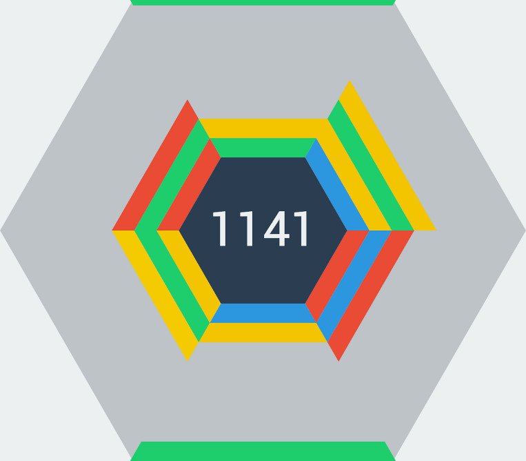

<!--
Este archivo README esta generado automaticamente<https://github.com/YunoHost/apps/tree/master/tools/readme_generator>
No se debe editar a mano.
-->

# Hextris para Yunohost

[](https://ci-apps.yunohost.org/ci/apps/hextris/)  

[](https://install-app.yunohost.org/?app=hextris)

*[Leer este README en otros idiomas.](./ALL_README.md)*

> *Este paquete le permite instalarHextris rapidamente y simplement en un servidor YunoHost.*  
> *Si no tiene YunoHost, visita [the guide](https://yunohost.org/install) para aprender como instalarla.*

## Descripción general

HEXTRIS is a fast paced puzzle game inspired by Tetris.
Blocks start on the edges of the screen, and fall towards the inner blue hexagon.
The objective of the game is to prevent the blocks from stacking outside the area of the grey hexagon.
To do this, you must rotate the hexagon to manage different stacks of blocks on each face.
Aim to connect 3 or more blocks of the same color: when 3 or more blocks of the same color touch each other, they are destroyed, and the blocks above them slide down!
Destroying multiple series of blocks grants combos, whose durations are indicated by a quickly receding outline around the outer, grey hexagon.
You lose once blocks on a face of the hexagon stack outside of the outer hexagon!


**Versión actual:** 2023.06.09~ynh2

**Demo:** <https://hextris.io/>

## Capturas



## Documentaciones y recursos

- Sitio web oficial: <http://hextris.github.io/>
- Repositorio del código fuente oficial de la aplicación : <https://github.com/Hextris/Hextris>
- Catálogo YunoHost: <https://apps.yunohost.org/app/hextris>
- Reportar un error: <https://github.com/YunoHost-Apps/hextris_ynh/issues>

## Información para desarrolladores

Por favor enviar sus correcciones a la [`branch testing`](https://github.com/YunoHost-Apps/hextris_ynh/tree/testing

Para probar la rama `testing`, sigue asÍ:

```bash
sudo yunohost app install https://github.com/YunoHost-Apps/hextris_ynh/tree/testing --debug
o
sudo yunohost app upgrade hextris -u https://github.com/YunoHost-Apps/hextris_ynh/tree/testing --debug
```

**Mas informaciones sobre el empaquetado de aplicaciones:** <https://yunohost.org/packaging_apps>
